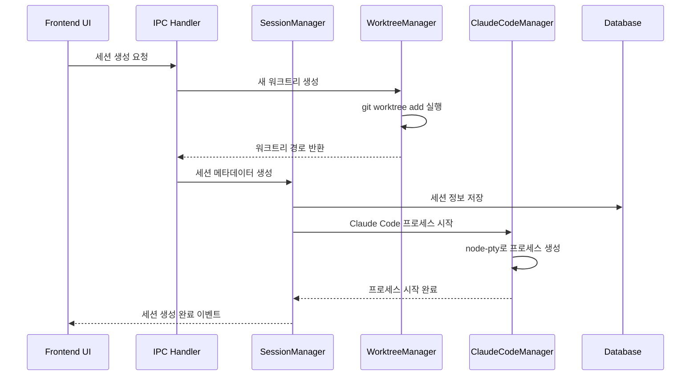

# Crystal 프로젝트 핵심 기능 분석

## 프로젝트 개요

Crystal은 Claude Code의 여러 인스턴스를 동시에 관리할 수 있는 Electron 기반 데스크톱 애플리케이션입니다. Git Worktree를 활용하여 각 Claude Code 세션이 독립된 브랜치에서 작업할 수 있도록 하여, 병렬 개발 환경을 제공합니다.

### 주요 특징
- **병렬 세션 실행**: 여러 Claude Code 인스턴스를 동시에 실행
- **Git Worktree 격리**: 각 세션이 독립된 git 브랜치에서 작업
- **세션 지속성**: 대화 중단 후 언제든 재개 가능
- **Git 통합**: diff 보기, commit, rebase 등 Git 작업 내장
- **변경사항 추적**: 모든 수정사항을 실시간으로 추적
- **알림 시스템**: 세션 상태 변화 시 데스크톱 알림
- **스크립트 실행**: Crystal 내에서 테스트 및 빌드 스크립트 실행

## 프로젝트 구조

```
crystal/
├── frontend/         # React 기반 UI (렌더러 프로세스)
├── main/            # Node.js 기반 백엔드 로직 (메인 프로세스)
├── shared/          # 프론트엔드/백엔드 공통 타입 정의
├── build/           # Electron 빌드 관련 파일
├── docs/            # 프로젝트 문서
└── scripts/         # 빌드 및 유틸리티 스크립트
```

## 핵심 파일 및 역할 분석

### 1. 메인 프로세스 (main/)

#### main/src/index.ts (414줄)
**역할**: Electron 애플리케이션의 진입점
- Electron 앱 초기화 및 윈도우 생성
- 모든 서비스 인스턴스 생성 및 초기화
- IPC 핸들러 등록
- 자동 업데이트 설정
- 개발 모드에서 워크트리 이름 표시

**핵심 기능**:
```typescript
// 앱 초기화 시 모든 서비스 생성
const services: AppServices = {
  taskQueue: new TaskQueue(),
  sessionManager: new SessionManager(db),
  configManager: new ConfigManager(),
  worktreeManager: new WorktreeManager(),
  gitDiffManager: new GitDiffManager(),
  // ... 기타 서비스들
};
```

#### main/src/database/database.ts (1000줄+)
**역할**: SQLite 데이터베이스 관리
- 데이터베이스 스키마 초기화
- 마이그레이션 관리
- 프로젝트, 세션, 대화 메시지 등 모든 데이터 CRUD 작업

**핵심 테이블**:
- `projects`: 프로젝트 정보 및 설정
- `sessions`: 세션 메타데이터
- `session_outputs`: 터미널 출력 기록
- `conversation_messages`: 대화 기록
- `execution_diffs`: Git diff 추적
- `prompt_markers`: 프롬프트 네비게이션용 마커

#### main/src/services/sessionManager.ts (1000줄+)
**역할**: Claude Code 세션 생명주기 관리
- 세션 생성, 시작, 중지, 삭제
- Claude Code 프로세스 관리 (node-pty 사용)
- 터미널 입출력 처리
- 세션 상태 추적 및 이벤트 발생

**핵심 기능**:
```typescript
class SessionManager extends EventEmitter {
  private activeSessions: Map<string, Session> = new Map();
  private terminalSessionManager: TerminalSessionManager;
  
  // 세션 생성 및 Claude Code 프로세스 시작
  async createSession(data: CreateSessionData): Promise<Session>
  
  // 세션에 입력 전송
  async sendInput(sessionId: string, input: string): Promise<void>
  
  // 세션 상태 변경 추적
  updateSessionStatus(sessionId: string, status: SessionStatus): void
}
```

#### main/src/services/worktreeManager.ts
**역할**: Git Worktree 관리
- 새로운 워크트리 생성
- 워크트리 정리 및 삭제
- 브랜치 관리
- Git 저장소 초기화

**핵심 기능**:
```typescript
class WorktreeManager {
  // 새 워크트리 생성
  async createWorktree(projectPath: string, branchName: string): Promise<string>
  
  // 워크트리 삭제
  async removeWorktree(worktreePath: string): Promise<void>
  
  // 메인 브랜치에서 리베이스
  async rebaseFromMain(worktreePath: string): Promise<void>
}
```

#### main/src/services/gitDiffManager.ts
**역할**: Git 변경사항 추적 및 diff 생성
- 워크트리의 모든 변경사항 추적
- diff 생성 및 파일별 통계
- 커밋되지 않은 변경사항 감지

#### main/src/ipc/ (모듈화된 IPC 핸들러들)
**역할**: 프론트엔드-백엔드 통신 인터페이스

**주요 파일들**:
- `git.ts` (843줄): Git 관련 모든 IPC 핸들러
- `session.ts` (428줄): 세션 관리 IPC 핸들러
- `project.ts`: 프로젝트 관리 IPC 핸들러
- `config.ts`: 설정 관리 IPC 핸들러

### 2. 렌더러 프로세스 (frontend/)

#### frontend/src/App.tsx
**역할**: React 애플리케이션의 루트 컴포넌트
- 전체 UI 레이아웃 관리
- 글로벌 상태 관리
- 키보드 단축키 처리
- 모달 및 다이얼로그 관리

#### frontend/src/components/SessionView.tsx
**역할**: 개별 세션의 메인 인터페이스
- 터미널 출력 표시 (XTerm.js 사용)
- 사용자 입력 처리
- 세션 상태 표시
- 다양한 뷰 모드 지원 (Output, Messages, Diff, Terminal)

#### frontend/src/components/Sidebar.tsx
**역할**: 사이드바 네비게이션
- 프로젝트 선택기
- 세션 목록 표시
- 프롬프트 히스토리
- 도움말 및 설정 접근

#### frontend/src/components/DraggableProjectTreeView.tsx
**역할**: 프로젝트 및 세션 트리 뷰
- 계층적 프로젝트/세션 구조 표시
- 드래그 앤 드롭 정렬 (향후 기능)
- 세션 상태 표시
- 컨텍스트 메뉴 지원

#### frontend/src/stores/ (Zustand 상태 관리)
**역할**: 클라이언트 사이드 상태 관리

**주요 스토어들**:
- `sessionStore.ts`: 세션 목록 및 현재 세션 상태
- `errorStore.ts`: 에러 처리 및 표시
- `navigationStore.ts`: 네비게이션 상태

### 3. 공통 타입 (shared/)

#### shared/types.ts
**역할**: 프론트엔드/백엔드 간 공통 타입 정의
- 커밋 모드 설정
- 프로젝트 특성 분석
- 세션 종료 옵션
- 기본 설정값

## 핵심 기능 동작 원리

### 1. 세션 생성 및 실행 프로세스



**상세 과정**:

1. **워크트리 생성**: 
   - 메인 브랜치에서 새 브랜치 생성
   - `git worktree add` 명령으로 독립된 작업 공간 생성
   - 워크트리 경로를 세션에 연결

2. **Claude Code 프로세스 시작**:
   - node-pty를 사용하여 가상 터미널 생성
   - Claude Code 실행파일을 워크트리 경로에서 시작
   - 프로세스 출력을 실시간으로 캡처

3. **데이터베이스 저장**:
   - 세션 메타데이터 저장
   - 터미널 출력을 실시간으로 저장
   - 대화 메시지 기록

### 2. 실시간 터미널 출력 처리

```typescript
// ClaudeCodeManager에서 출력 처리
private handleProcessOutput(sessionId: string, data: string) {
  // 1. 원본 출력을 데이터베이스에 저장
  this.db.addSessionOutput(sessionId, data, 'stdout');
  
  // 2. JSON 메시지인지 확인
  if (this.isJsonMessage(data)) {
    const formatted = this.formatJsonOutput(data);
    // 3. 포맷된 출력을 프론트엔드로 전송
    this.emit('session-output', { sessionId, data: formatted, type: 'stdout' });
  } else {
    // 4. 일반 텍스트는 그대로 전송
    this.emit('session-output', { sessionId, data, type: 'stdout' });
  }
}
```

### 3. Git 통합 워크플로우

#### Diff 생성 및 표시:
```typescript
// GitDiffManager에서 변경사항 추적
async generateDiff(worktreePath: string): Promise<DiffResult> {
  // 1. git diff 명령 실행
  const diffOutput = await this.executeGitDiff(worktreePath);
  
  // 2. 파일별 통계 계산
  const stats = await this.calculateDiffStats(worktreePath);
  
  // 3. 구문 강조를 위한 파일 내용 분석
  const formattedDiff = await this.formatDiffWithSyntaxHighlighting(diffOutput);
  
  return { diff: formattedDiff, stats };
}
```

#### 커밋 및 리베이스:
```typescript
// CommitManager에서 커밋 처리
async squashAndRebaseToMain(worktreePath: string, commitMessage: string): Promise<void> {
  // 1. 모든 변경사항을 하나의 커밋으로 스쿼시
  await this.executeCommand('git reset --soft HEAD~n', worktreePath);
  await this.executeCommand(`git commit -m "${commitMessage}"`, worktreePath);
  
  // 2. 메인 브랜치로 리베이스
  await this.executeCommand('git checkout main', this.projectPath);
  await this.executeCommand('git pull origin main', this.projectPath);
  await this.executeCommand(`git rebase main ${branchName}`, this.projectPath);
}
```

### 4. 이벤트 기반 아키텍처

Crystal은 EventEmitter 패턴을 사용하여 컴포넌트 간 느슨한 결합을 유지합니다:

```typescript
// SessionManager에서 이벤트 발생
this.emit('session-status-changed', { sessionId, status: 'running' });

// Frontend에서 이벤트 수신
useEffect(() => {
  const handleStatusChange = (data) => {
    updateSessionStatus(data.sessionId, data.status);
  };
  
  window.electron.on('session-status-changed', handleStatusChange);
  return () => window.electron.off('session-status-changed', handleStatusChange);
}, []);
```

### 5. 데이터 지속성 및 세션 복원

#### 세션 데이터 저장:
```sql
-- 대화 메시지 저장
INSERT INTO conversation_messages (session_id, message_type, content, timestamp)
VALUES (?, ?, ?, datetime('now'));

-- 터미널 출력 저장
INSERT INTO session_outputs (session_id, output_data, output_type, timestamp)
VALUES (?, ?, ?, datetime('now'));
```

#### 세션 복원:
```typescript
async restoreSession(sessionId: string): Promise<void> {
  // 1. 데이터베이스에서 대화 기록 로드
  const messages = this.db.getConversationMessages(sessionId);
  
  // 2. Claude Code에 대화 컨텍스트 전송
  await this.claudeCodeManager.restoreConversation(sessionId, messages);
  
  // 3. 터미널 출력 기록 복원
  const outputs = this.db.getSessionOutputs(sessionId);
  this.displayStoredOutputs(sessionId, outputs);
}
```

## 성능 최적화 기법

### 1. 지연 로딩 (Lazy Loading)
- 세션 출력은 필요시에만 로드
- 대용량 diff는 가상화하여 표시

### 2. 디바운싱 (Debouncing)
- 터미널 출력 업데이트를 배치 처리
- Git 상태 확인을 주기적으로 실행

### 3. 메모리 관리
- 오래된 출력 기록 정리
- 비활성 세션의 메모리 사용량 최소화

## 확장성 고려사항

### 1. 플러그인 시스템
- MCP (Model Context Protocol) 지원으로 확장 가능
- 커스텀 도구 통합 가능

### 2. 다중 프로젝트 지원
- 프로젝트별 독립적인 설정
- 프로젝트 간 세션 격리

### 3. 클라우드 통합
- 원격 Claude Code 인스턴스 지원
- 설정 및 세션 동기화 가능

이러한 아키텍처를 통해 Crystal은 복잡한 AI 기반 개발 워크플로우를 효율적으로 관리할 수 있는 강력한 도구를 제공합니다.